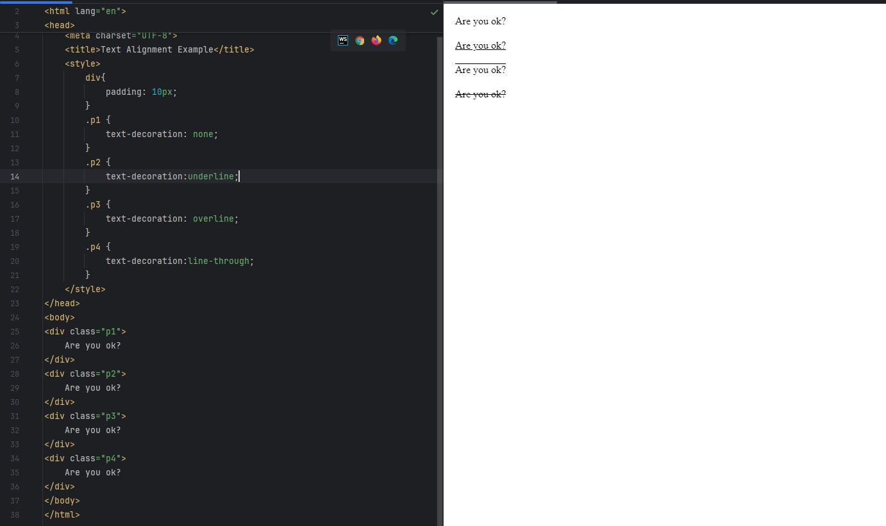
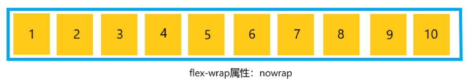
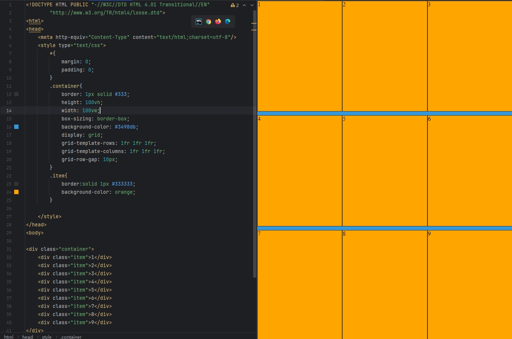

# CSS

## 简介

html负责显示内容,CSS负责内容的显示效果

* 简单语法

  ```css
  property_name: value
  ```

  

* 使用方式

  * 将css写在html标签的style属性中

    ```html
    <!DOCTYPE html>
    <html lang="en">
    <head>
        <meta charset="UTF-8">
        <title>Title</title>
    </head>
    <body>
    <div style="border:solid 1px red;">hello</div>
    </body>
    </html>
    ```

    

  * 写在html的style标签中，使用css选择器定位

    ```html
    <!DOCTYPE html>
    <html lang="en">
    <head>
        <meta charset="UTF-8">
        <title>Title</title>
        <style>
            .hello{
                border:solid 1px red;
            }
        </style>
    </head>
    <body>
    <div class="hello">hello</div>
    </body>
    </html>
    ```

## 文本样式

用来控制争端文本的显示效果

### color 文本颜色

```html
<!DOCTYPE html>
<html lang="en">
<head>
    <meta charset="UTF-8">
    <title>Title</title>
    <style>
        .en-word{
            color: red;
        }
    </style>
</head>
<body>
<div class="en-word">
    hello
</div>
</body>
</html>
```

### text-indent 文本缩进

```html
<!DOCTYPE html>
<html lang="en">
<head>
    <meta charset="UTF-8">
    <title>Title</title>
    <style>
        .en-word{
            text-indent: 2em; //两个front-size宽度的缩进
        }
    </style>
</head>
<body>
<div class="en-word">
    requestAnimationFrame 是一个用于在浏览器中实现高效动画的方法。它告诉浏览器你希望执行一个动画，并在下一次重绘之前调用指定的回调函数来更新动画。浏览器会自动优化动画的刷新频率，以确保动画的流畅性和性能。requestAnimationFrame 是一个用于在浏览器中实现高效动画的方法。它告诉浏览器你希望执行一个动画，并在下一次重绘之前调用指定的回调函数来更新动画。浏览器会自动优化动画的刷新频率，以确保动画的流畅性和性能。requestAnimationFrame 是一个用于在浏览器中实现高效动画的方法。它告诉浏览器你希望执行一个动画，并在下一次重绘之前调用指定的回调函数来更新动画。浏览器会自动优化动画的刷新频率，以确保动画的流畅性和性能。
</div>
</body>
</html>
```


### text-align  文本对齐方式

* left

  左对齐

  

* right

  右对齐

  

  

* center

  文本排列中间

  

* justify

  会自动调整两个单词之间的间隔，一段长文本的两端可以对齐

  

* inherit

  从父元素继承text-align属性

  注意: `text-align: inherit` 不是默认行为，但由于 `text-align` 是一个可继承的属性，子元素会自动继承父元素的 `text-align` 值，所以inherit写不写都可以
  

### word-spacing 单词间隔

只对英文有效


### letter-spacing 字符间隔


### text-decoration 文本修饰

none: 不需要

underline: 下划线

overline: 上划线

line-through: 删除线




### line-height 行高


### text-shadow 文本阴影

  text-shadow: 5px 5px 5px #FF0000; 指定了水平阴影，垂直阴影，阴影的模糊程度，阴影的颜色：


## 字体样式

### font-family 字体

指定的字体,通用字体

通常前面的字体可能是不通用的字体名，但是后面的一定会放现代浏览器都支持的通用字体

```html
        p {
            font-family:"Times New Roman",Georgia,Serif;
        }
```


### font-size 字体大小

```html
        .en-word{
            font-size: 40px;
        }
```


### font-weight 字体粗细

可取值

normal(400 ) 默认值

bold(700 )

bolder

比父元素的粗细更粗。

lighter

比父元素的粗细更细。

数值(100-900)

```html

    <style>
        .parent{
            font-size: 50px;
            font-weight: bold;
        }
        .child{
            font-weight: lighter;
        }
    </style>
<div class="parent">
    hello
    <div class="child">
        world
    </div>
</div>

```


### font-style 字体风格，斜体

```shell
        .parent{
            font-size: 50px;
            font-style: italic;
        }
```


### font 

可以把上面的样式属性合起来写（值是有序的，使用空格分隔）
字体风格，字体大小，字体名称


### color  字体颜色


## 盒子模型样式


### box-shadow 盒子阴影

box-shadow: 5px 5px 5px #FF0000; 指定了水平阴影，垂直阴影，阴影的模糊程度，阴影的颜色：


### box-sizing 固定总高宽

元素的总高度和宽度包含内边距和边框(padding 与 border) :


## 盒子的定位

通过对每个盒子的外边距,边框,内边距,内容,位置的精确控制,CSS可以实现复杂而精确的页面布局

块级元素:这个元素默认有换行效果,谷歌f12可以看到div里面有display: block;

行内元素:这类元素默认没有换行效果,典型的如span

文档流:HTML元素在页面上显示时,根据在源码中出现的次序,按照从上到下,从左到右,快级元素独占一行,行内元素不换行的规则依次排列.文档流中的元素会对后续元素的位置产生影响

盒子定位:弹性布局(flexbox),网格布局(grid),相对定位,绝对定位,固定定位,浮动

### flex 弹性布局

flex是flexible box的缩写，译为“弹性布局”，用来为盒模型提供最大的灵活性，任何一个容器都可以指定为flex布局，只需要设置“display:flex"即可；行内元素可以通过设置”display:inline-flex“实现；需要注意的是，如果设置了flex布局，则子元素的float、clear和vertical-align属性将失效。

flex布局是一种布局模型，经常被称之为flexbox，使用flex布局之后，他会给子元素提供强大空间分配和对齐能力。

在没有使用flex布局之前，常用布局有：流式布局，浮动布局，定位布局等等。缺陷是子元素需要自己控制自己在父元素中的位置，还要注意父元素高度坍塌。

flex的优点就是避免不灵活的布局形式，创建更多种布局模式供你选择，解决了子元素的对齐和分布与 响应式等问题。缺点是只能依靠自身的布局模式，稍有变化则无法改变。

使用了flex布局的元素，称为flex容器（flex container），简称为”容器“。它所有的子元素自动生成容器成员，称为flex项目（flex item），简称”项目”；


容器默认存在两根主轴：水平的主轴（main axis）和垂直的交叉轴（cross axis），主轴的开始位置（即边框的交叉点）叫做main start，结束位置叫做main end；交叉轴的开始位置叫做cross start，结束位置叫做cross end。项目默认沿主轴排列，单个项目占据的主轴空间叫做main size，占据的交叉轴空间叫做cross size。


#### display:flex 弹性布局盒子

```css
        .container{
            display: flex; //指定盒子类型为弹性布局盒子类型
        }
```

流式布局会导致容器内的元素自动按横向排列。


#### flex-direction 子元素排列方向

* row

  主轴沿水平方向从左到右

* row-reverse

  主轴沿水平方向从右到左

* column

  主轴沿垂直方向从上到下

* column-reverse

  主轴沿垂直方向从下到上

* initial

  当你将 `flex-direction` 设置为 `initial` 时，实际上是将其重置为 **默认值**，即 `row`。这个行为与直接设置 `flex-direction: row` 的效果相同。

  #### 解释：

  - `initial` 是 CSS 中的一个关键字，用于将属性恢复为其 **默认值**。
  - 对于 `flex-direction` 属性，**默认值是 `row`**，因此 `flex-direction: initial` 和 `flex-direction: row` 具有相同的效果。

* inherit

  从父元素集成flex-direction的值

  ```html
  <!DOCTYPE HTML PUBLIC "-//W3C//DTD HTML 4.01 Transitional//EN"
          "http://www.w3.org/TR/html4/loose.dtd">
  <html>
  <head>
      <meta http-equiv="Content-Type" content="text/html;charset=utf-8"/>
      <style type="text/css">
          .container{
              border:solid 1px gray;
              padding: 2px;
              margin-top: 50px;
              display: flex;
          }
          .container1{
              flex-direction: row;
          }
          .container2{
              flex-direction: row-reverse;
          }
          .container3{
              flex-direction: column;
          }
          .container4{
              flex-direction: column-reverse;
          }
          .item{
              border:solid 1px red;
          }
      </style>
  </head>
  <body>
  <div class="container container1">
      <div class="item">1</div>
      <div class="item">2</div>
      <div class="item">3</div>
      <div class="item">4</div>
  </div>
  <div class="container container2">
      <div class="item">1</div>
      <div class="item">2</div>
      <div class="item">3</div>
      <div class="item">4</div>
  </div>
  <div class="container container3">
      <div class="item">1</div>
      <div class="item">2</div>
      <div class="item">3</div>
      <div class="item">4</div>
  </div>
  <div class="container container4">
      <div class="item">1</div>
      <div class="item">2</div>
      <div class="item">3</div>
      <div class="item">4</div>
  </div>
  </body>
  </html>
  ```

  效果:

  

#### flex-wrap 挤不下换行

  默认情况下，项目都排在一条线（又称”轴线“）上，flex-wrap属性定义，如果一条轴线排不下，如何换行，有以下三个取值：

```css
.box{
    flex-wrap:nowrap|wrap|wrap-reverse
}
```

● nowrap（默认）：不换行，排列方式效果如图：



● wrap：换行，第一行在上方，排列方式效果如图：


● wrap-reverse：换行，第一行在下方，排列方式效果如图：


#### justify-content 子元素水平对齐方式

该属性有5个值：

● flex-start（默认值）：左对齐；

● flex-end：右对齐；

● center：居中；

● space-between：两端对齐，项目之间的间隔都相等；

● space-around：每个项目两侧的间隔相等，所以项目之间的间隔比项目与边框的间隔大一倍；


```html
<!DOCTYPE HTML PUBLIC "-//W3C//DTD HTML 4.01 Transitional//EN"
        "http://www.w3.org/TR/html4/loose.dtd">
<html>
<head>
    <meta http-equiv="Content-Type" content="text/html;charset=utf-8"/>
    <style type="text/css">
        .container{
            border:solid 1px gray;
            padding: 2px;
            margin-top: 50px;
            display: flex;
            flex-direction: row;
            width: 300px;
        }
        .container1{
            justify-content: flex-start;
        }
        .container2{
            justify-content: flex-end;
        }
        .container3{
            justify-content: center;
        }
        .container4{
            justify-content: space-between;
        }
        .container5{
            justify-content: space-around;
        }
        .item{
            border:solid 1px red;
            width: 25%;
        }
    </style>
</head>
<body>
<div class="container container1">
    <div class="item">1</div>
    <div class="item">2</div>
    <div class="item">3</div>
</div>
<div class="container container2">
    <div class="item">1</div>
    <div class="item">2</div>
    <div class="item">3</div>

</div>
<div class="container container3">
    <div class="item">1</div>
    <div class="item">2</div>
    <div class="item">3</div>

</div>
<div class="container container4">
    <div class="item">1</div>
    <div class="item">2</div>
    <div class="item">3</div>
</div>
<div class="container container5">
    <div class="item">1</div>
    <div class="item">2</div>
    <div class="item">3</div>
</div>

</body>
</html>

```

效果：


#### align-items 子元素垂直对齐方式

该属性有5个值，具体的对齐方式与交叉轴的方向有关，假设交叉轴从上到下：

● flex-start：交叉轴的起点对齐；

● flex-end：交叉轴的中点对齐；

● center：交叉轴的中点对齐；

● stretch（默认值）：如果项目未设置高度或设置为auto，将占满整个容器的高度；

● baseline：项目的第一行文字的基线对齐；


上述效果如下图所示：


html:

```html
<!DOCTYPE HTML PUBLIC "-//W3C//DTD HTML 4.01 Transitional//EN"
        "http://www.w3.org/TR/html4/loose.dtd">
<html>
<head>
    <meta http-equiv="Content-Type" content="text/html;charset=utf-8"/>
    <style type="text/css">
        .container{
            border:solid 1px gray;
            padding: 2px;
            margin-top: 50px;
            display: flex;
            flex-direction: row;
            justify-content: space-around;
            width: 300px;
            min-height: 50px;
        }
        .container1{
            align-items: flex-start;
        }
        .container2{
            align-items: flex-end;
        }
        .container3{
            align-items: center;
        }
        .container4{
            align-items: stretch;
        }
        .container5{
            align-items: baseline;
        }
        .item{
            border:solid 1px red;
            width: 25%;
        }
    </style>
</head>
<body>
<div class="container container1">
    <div class="item">1</div>
    <div class="item">2</div>
    <div class="item">3</div>
</div>
<div class="container container2">
    <div class="item">1</div>
    <div class="item">2</div>
    <div class="item">3</div>

</div>
<div class="container container3">
    <div class="item">1</div>
    <div class="item">2</div>
    <div class="item">3</div>

</div>
<div class="container container4">
    <div class="item">1<br>2</div>
    <div class="item">1<br>2<br>3</div>
    <div class="item">1<br>2<br>3<br>4</div>
</div>
<div class="container container5">
    <div class="item">1<br>2</div>
    <div class="item">1<br>2<br>3</div>
    <div class="item">1<br>2<br>3<br>4</div>
</div>

</body>
</html>

```

效果:


#### order 子元素顺序

order 属性用来设置项目在容器中出现的顺序，您可以通过具体的数值来定义项目在容器中的位置，属性的语法格式如下：

```css
order: number;
```

代码:

```html
<!DOCTYPE HTML PUBLIC "-//W3C//DTD HTML 4.01 Transitional//EN"
        "http://www.w3.org/TR/html4/loose.dtd">
<html>
<head>
    <meta http-equiv="Content-Type" content="text/html;charset=utf-8"/>
    <style type="text/css">
        .container{
            border:solid 1px gray;
            padding: 2px;
            margin-top: 50px;
            display: flex;
            flex-direction: row;
            justify-content: space-around;
            align-items: center;
            width: 300px;
            min-height: 50px;
        }
        .item{
            border:solid 1px red;
            width: 25%;
        }
        .item1{
            order: 4;
        }
        .item2{
            order: 2;
        }
        .item3{
            order: 1;
        }
        .item4{
            order: 3;
        }
    </style>
</head>
<body>
<div class="container container1">
    <div class="item item1">1</div>
    <div class="item item2">2</div>
    <div class="item item3">3</div>
    <div class="item item4">4</div>
</div>
</body>
</html>
```

效果：


#### align-self 某个元素对齐方式

| 值         | 描述                                                         |
| ---------- | ------------------------------------------------------------ |
| auto       | 默认值，表示元素将继承其父容器的 align-items 属性值，如果没有父容器，则为“stretch” |
| stretch    | 项目将被拉伸以适合容器                                       |
| center     | 项目位于容器的中央                                           |
| flex-start | 项目位于容器的顶部                                           |
| flex-end   | 项目位于容器的底部                                           |
| baseline   | 项目与容器的基线对齐                                         |
| initial    | 将此属性设置为属性的默认值                                   |
| inherit    | 从父元素继承属性的值                                         |

```html
<!DOCTYPE HTML PUBLIC "-//W3C//DTD HTML 4.01 Transitional//EN"
        "http://www.w3.org/TR/html4/loose.dtd">
<html>
<head>
    <meta http-equiv="Content-Type" content="text/html;charset=utf-8"/>
    <style type="text/css">
        .container{
            border:solid 1px gray;
            padding: 2px;
            margin-top: 50px;
            display: flex;
            flex-direction: row;
            justify-content: space-around;
            align-items: center;
            width: 300px;
            min-height: 50px;
        }
        .item{
            border:solid 1px red;
            width: 25%;
        }
        .item2{
            align-self: flex-start;
        }
    </style>
</head>
<body>
<div class="container container1">
    <div class="item item1">1</div>
    <div class="item item2">2</div>
    <div class="item item3">3</div>
    <div class="item item4">4</div>
</div>
</body>
</html>

```

效果


#### flex 属性

flex 属性的作用是在 flexbox 布局中控制容器内的直接子元素的的增长、收缩和初始大小，从而实现灵活的空间分配和响应式布局。

他有三个参数:

* flex-grow

  控制直接子元素如何分配额外的空间,即控制直接子元素在项目空间变大时，是否拉伸，如何拉伸

* flex-shrink

  控制直接子元素在空间不足时如何缩小

* flex-basis

  设置直接子元素的初始大小

```html
<!DOCTYPE html>
<html lang="zh">
<head>
    <meta charset="UTF-8">
    <meta name="viewport" content="width=device-width, initial-scale=1.0">
    <title>Flex 属性可视化示例</title>
    <style>
        body {
            font-family: Arial, sans-serif;
            line-height: 1.6;
            padding: 20px;
        }
        .flex-container {
            display: flex;
            border: 2px solid #333;
            margin-bottom: 20px;
            height: 100px;
        }
        .flex-item {
            padding: 10px;
            background-color: #3498db;
            color: white;
            margin: 5px;
            text-align: center;
            display: flex;
            align-items: center;
            justify-content: center;
        }
        .grow-1 { flex: 1 1 100px; }
        .grow-2 { flex: 2 1 100px; }
        .no-grow { flex: 0 1 100px; }
        .no-shrink { flex: 1 0 200px; }
        .basis-only { flex: 0 0 150px; }
    </style>
</head>
<body>
    <h1>Flex 属性可视化示例</h1>
    
    <div class="flex-container">
        <div class="flex-item grow-1">1倍增长</div>
        <div class="flex-item grow-2">2倍增长</div>
        <div class="flex-item no-grow">不增长</div>
        <div class="flex-item no-shrink">不收缩</div>
        <div class="flex-item basis-only">固定宽度</div>
    </div>

    <h2>解释：</h2>
    <ul>
        <li><strong>flex-grow</strong>：决定元素如何分配额外空间。值越大，分配到的空间越多。</li>
        <li><strong>flex-shrink</strong>：决定元素如何收缩。值为0时不收缩，值越大收缩得越多。</li>
        <li><strong>flex-basis</strong>：设置元素的初始大小。</li>
    </ul>
    <p>尝试调整浏览器窗口大小，观察各个元素如何变化：</p>
    <ul>
        <li>"1倍增长"和"2倍增长"的元素会随着容器变大而增长，但"2倍增长"增长得更快。</li>
        <li>"不增长"的元素保持其初始大小，除非被迫收缩。</li>
        <li>"不收缩"的元素在空间不足时不会变小，可能会溢出容器。</li>
        <li>"固定宽度"的元素始终保持其设定的宽度，不增长也不收缩。</li>
    </ul>
</body>
</html>
```

效果


flex-grow与flex-shrink的取值代表什么，有哪些取值

1. **`flex-grow`** 的取值：

- **`flex-grow`** 定义了在可用空间（剩余空间）里，元素的 **增长比例**。值越大，元素会 **占据更多** 剩余的空间。

  取值：

  - **0**：如果设置为 0，表示该元素 **不增长**，即使有剩余空间，它也不会占用。
  - **大于 0**：如果设置为一个大于 0 的数字，元素会占据剩余空间，数字越大，占的空间越多。比如，如果有两个元素，`flex-grow: 1` 和 `flex-grow: 2`，那么第二个元素会占用比第一个元素更多的空间。

  **常见用法**：

  - 默认值是 `0`，表示元素不扩展。
  - 常见的值是 `1`，表示所有元素会均匀分配剩余空间。如果多个元素的 `flex-grow` 都是 1，它们会平分剩余的空间。

2. **`flex-shrink`** 的取值：

- **`flex-shrink`** 定义了在容器空间不足时，元素的 **收缩比例**。值越大，元素会 **收缩得越多**，从而释放更多空间给其他元素。

  取值：

  - **0**：如果设置为 0，表示该元素 **不会缩小**，即使容器空间不足，它也不会收缩，可能导致溢出。
  - **大于 0**：如果设置为一个大于 0 的数字，元素会在容器空间不足时缩小，数字越大，收缩的幅度越大。

  **常见用法**：

  - 默认值是 `1`，表示元素会收缩以适应容器。
  - 设置为 `0` 时，元素就不会缩小，通常在某些元素不能缩小时使用，比如需要保持内容可见的图标或按钮。

**总结**：

- **`flex-grow`** 的常见取值是 0 或者一个正整数，表示元素如何占用剩余空间。数字越大，元素分到的空间越多。
- **`flex-shrink`** 的常见取值是 0 或者一个正整数，表示元素如何在空间不足时收缩。数字越大，元素收缩得越多。

举个例子：

假设有一个容器宽度为 500px，里面有三个子元素，分别设置了 `flex-grow` 和 `flex-shrink`：

- 子元素 1：`flex-grow: 1`, `flex-shrink: 1`
- 子元素 2：`flex-grow: 2`, `flex-shrink: 1`
- 子元素 3：`flex-grow: 1`, `flex-shrink: 0`

**如果容器有剩余空间：**

- 子元素 1 和 2 会根据 `flex-grow` 的比例分配剩余空间。由于子元素 2 的 `flex-grow` 是 2，子元素 1 的 `flex-grow` 是 1，所以子元素 2 会分配到更多的空间（2 倍于子元素 1 的空间）。

**如果容器空间不够：**

- 子元素 1 和 2 会根据 `flex-shrink` 的比例缩小。由于它们的 `flex-shrink` 值相同，都会缩小，但是子元素 3 的 `flex-shrink: 0`，它就不会缩小。


#### flex-flow 组合属性

**flex-flow**：该属性作用于弹性盒容器，用于控制容器内元素的排列方向和换行方式，该属性是一个复合属性，由flex-direction和flex-wrap组成；

```css
.box{
    flex-flow:<flex-direction><flex-wrap>;
}
```


### grid 网格布局

网格布局（Grid）是最强大的 CSS 布局方案。

它将网页划分成一个个网格，可以任意组合不同的网格，做出各种各样的布局。以前，只能通过复杂的 CSS 框架达到的效果，现在浏览器内置了。

Grid 布局与 [Flex 布局](https://link.juejin.cn?target=http%3A%2F%2Fwww.ruanyifeng.com%2Fblog%2F2015%2F07%2Fflex-grammar.html)有一定的相似性，都可以指定容器内部多个项目的位置。但是，它们也存在重大区别。

Flex 布局是轴线布局，只能指定"项目"针对轴线的位置，可以看作是**一维布局**。Grid 布局则是将容器划分成"行"和"列"，产生单元格，然后指定"项目所在"的单元格，可以看作是**二维布局**。Grid 布局远比 Flex 布局强大。

#### 基本概念

##### 容器与项目


采用网格布局的区域，称为"容器"（container）。容器内部采用网格定位的子元素，称为"项目"（item）。

```html
<div>
  <div><p>1</p></div>
  <div><p>2</p></div>
  <div><p>3</p></div>
</div>
```

上面代码中，最外层的`<div>`元素就是容器，内层的三个`<div>`元素就是项目。

注意：项目只能是容器的顶层子元素，不包含项目的子元素，比如上面代码的`<p>`元素就不是项目。Grid 布局只对项目生效。


##### 行和列

容器里面的水平区域称为"行"（row），垂直区域称为"列"（column）。


上图中，水平的深色区域就是"行"，垂直的深色区域就是"列"。

##### 单元格

行和列的交叉区域，称为"单元格"（cell）。

正常情况下，`n`行和`m`列会产生`n x m`个单元格。比如，3行3列会产生9个单元格。

##### 网格线

划分网格的线，称为"网格线"（grid line）。水平网格线划分出行，垂直网格线划分出列。

正常情况下，`n`行有`n + 1`根水平网格线，`m`列有`m + 1`根垂直网格线，比如三行就有四根水平网格线。


上图是一个 4 x 4 的网格，共有5根水平网格线和5根垂直网格线。

#### 容器属性

Grid 布局的属性分成两类。一类定义在容器上面，称为容器属性；另一类定义在项目上面，称为项目属性。

##### display: grid 网格布局盒子

容器是块级元素，和容器同级别的元素会换行

注意，设为网格布局以后，容器子元素（项目）的`float`、`display: inline-block`、`display: table-cell`、`vertical-align`和`column-*`等设置都将失效。

```css
div {
  display: grid;
}
```

代码:


##### display: inline-grid 网格布局盒子

认情况下，容器元素都是块级元素，但也可以设成行内元素。

```css
div {
  display: inline-grid;
}
```

`inline-grid` 会让容器 `.container` 以行内方式排列，但容器内部的元素（`.item`）仍然会按照 CSS Grid 的规则来排列，默认情况下，每个 `.item` 占用一行。


注意：
设为网格布局以后，容器子元素（项目）的`float`、`display: inline-block`、`display: table-cell`、`vertical-align`和`column-*`等设置都将失效。


##### grid-template-columns 划分列

定义每一列的列宽，就是每列的宽度

##### grid-template-rows 划分行

定义每一行的行高，就是每行的高度


##### 划分的单位

###### 像素px


###### 百分比%

除了使用绝对的像素单位，也可以使用百分比。


###### fr 均分

使用这个单位，可以使行列的宽高可以均分


##### gap 网格行列间距


##### gap-row-gap 网格行间距




##### gap-column-gap 网格列间距


##### grid-template-areas 通过命名区域简化布局

通过指定每个网格区域的名称来简化网格布局的设计

通过指定每个区域的名称，`grid-template-areas` 能够为网格创建一个“可视化”的结构，帮助开发者直观地定义布局。

通过命名区域，开发者可以避免复杂的 `grid-row` 和 `grid-column` 配置，从而减少 CSS 代码的复杂度。

给区域命名需要使用grid-area这个项目属性

代码

```html
<html>
<head>
    <meta http-equiv="Content-Type" content="text/html;charset=utf-8"/>
    <style type="text/css">
        * {
            margin: 0;
            padding: 0;
        }

        .container {
            border: 1px solid #333;
            height: 100vh;
            width: 100vw;
            box-sizing: border-box;
            background-color: #3498db;
            display: grid;
            grid-template-areas: 'header header header header'
                                 'left main main right'
                                 'left main main right'
                                 'footer footer footer footer'; /**布局**/
        }
        .item {
            background-color: orange;
            border: solid 1px red;
            display: flex;
            align-items: center;
            justify-content: center;
        }
        .header {
            grid-area: header; /*项目命名*/
        }
        .left {
            grid-area: left;
        }
        .right {
            grid-area: right;
        }
        .main {
            grid-area: main;
        }
        .footer {
            grid-area: footer;
        }
    </style>
</head>
<body>
<div class="container">
    <div class="header item">header</div>
    <div class="left item">left</div>
    <div class="right item">right</div>
    <div class="main item">main</div>
    <div class="footer item">footer</div>
</div>
</body>
</html>

```

效果：


#### 项目属性

##### grid-column 跨列合并

可以用span表示跨这个动作


##### grid-row 跨行合并

可以用span表示跨这个动作


##### grid-area 跨行列合并/网格命名


除了可以指定行列数进行跨越，还能和grid-template-areas结合进行命名来简化网格布局的设计


### relative 相对定位

元素在显示时,相对自己本来的位置向下或者向右偏移指定数值,但元素本身并**不脱离文档流**,也就说**后面的元素还认为此元素在原来的位置**,所以会排列在此元素原本位置的后面(但会造成覆盖)
以左线为标准


### absolute 绝对定位

绝对定位:**以最近的已经定位的祖先元素为基准**进行偏移(如果没有这样的祖先元素则以浏览器窗口为基准),元素本身**脱离文档流**,也就是说后面元素认为此元素不存在,所以会占据此元素原来的位置(但会造成覆盖,脱离文档后就不具有快级元素独占一行的性质了)
以左上顶点为标准

特点: 不会脱离父元素盒子

请注意: 
**`position: absolute;`** 的元素会相对于其**最近的已定位祖先元素**来定位。这里的“已定位”指的是父元素或祖先元素的 `position` 属性值为 `relative`、`absolute`、`fixed` 或 `sticky`。
如果父元素没有设置 `position: relative;`（或者其他定位属性），则它会相对于 **最近的已定位祖先元素**，如果找不到，最终会相对于 **文档的根元素 `<html>`**（或 `<body>`）进行定位。


### fixed 固定定位

和绝对定位类似也会脱离文档流,但是以浏览器窗口为基准,而且位置不会随着滚动条移动


### float 浮动布局

可用于布局，用的更少了，float属性最初是为了实现文字环绕图片的效果而设计的，但它也常用于创建多列布局。然而，在现代Web开发中，对于复杂的布局，我们通常更推荐使用Flexbox或Grid布局。

```css
element {
  float: left | right | none | inherit;
}
```

会导致同级别的元素环绕在周围


使用clear:both可以让同级别的元素脱离float影响
```css
        .num3{
            clear: both;
        }
```


## 样式属性值

### 颜色值

* 颜色名

  red,blue等表示颜色的英文单词

* RGB颜色
  rgb(255,0,0)由十进制的三个颜色分量组成，分量取值范围【0，255】
* RGBA颜色
  rgba(255,0,0,0.5)由十进制的三个颜色分量和一个透明度分量组成，分量取值范围0~255，透明度取值范围0~1
* 十六进制颜色
  #FF0000    FF表示红色分量，中间两个0表示绿色分量，最后两个0表示蓝色分量

### 长度单位

#### px

像素，可以简单理解为屏幕上一个点的长度
#### %

百分比
#### em

一个字符的长度，1em一般代表的是你定义的font-size的大小宽度

#### vh、vw

vh: 视窗高度，1vh=视窗高度的1%

vw: 视窗宽度，1vw=视窗宽度的1%


#### in

英尺（不常用）
#### cm

厘米（不常用）
#### mm

毫米（不常有）


## 选择器

### *  所有元素

选择所有元素

```css
        * {
            padding: 0;
            margin: 0;
            box-sizing: border-box;
        }
```


### 标签选择器

 选择所有<p>元素

```css
p {
    
}
```


### id选择器


### class选择器


### 属性选择器


### 伪类选择器


#### :hover 鼠标在范围内

```css
        .box:hover{
            cursor: pointer; /*default|pointer|move|text...*/
        }
```


#### :active 鼠标按下


#### :focus 输入框/按钮被点击

不能作用于div


#### :before 之前插入一个虚拟元素

注意: 不能直接在 `:before` 中插入像 `<div>` 这样的元素。`content` 只能用来插入文本、图像（通过 `url()`）、符号、计数器值等内容，而不能插入实际的 HTML 元素。

```css
div:before {
  content: "前缀：";
}
```


#### :after 之后插入一个虚拟元素

```css
div:after {
  content: "前缀：";
}
```


#### :nth-child(n) 特定位置的子元素。

选择父元素下第2个li
```css
li:nth-child(2) {
}
```


### 复合选择器

#### 空格 后代

选择所有div下的p元素
```css
div p {
}
```


#### > 子元素

选择所有父级是 <div> 元素的 <p> 元素

```css
div>p {
}
```


#### - 后续兄弟元素


#### + 后续紧邻兄弟元素

选择所有紧跟在 <div> 元素之后的第一个 <p> 元素

```css
div+p {
}
```


#### ,并集

选择所有div和p元素

```css
div,p {
    
}
```


#### 没有空格 交集

选择所有 class="hometown" 的 <p> 元素

```css
p.hometown{
}
```


## 动画

### transition 过渡

注意: transform于transition结合的是单帧动画，也就是固定了其实和结束位置，无法改变

`transition` 用于创建平滑的过渡效果，使元素的属性值在某一段时间内从一个状态过渡到另一个状态。你可以通过 `transition` 属性来指定哪些属性应该有过渡效果，以及过渡的时间和动画曲线等。

```css
transition: <property> <duration> <timing-function> <delay>;
```

**`<property>`**: 指定要应用过渡的属性，通常是可以动画化的 CSS 属性，如 `width`, `height`, `background-color`, `transform` 等。如果你想让所有支持过渡的属性都生效，可以使用 `all`。

**`<duration>`**: 过渡的持续时间，单位为 `s`（秒）或 `ms`（毫秒）。例如 `0.3s` 或 `300ms`。

**`<timing-function>`**: 过渡的速度曲线，决定动画的速度变化。常用的值有：

- `linear`: 匀速过渡。
- `ease`: 默认值，先慢后快。
- `ease-in`: 动画开始时慢，结束时快。
- `ease-out`: 动画开始时快，结束时慢。
- `ease-in-out`: 动画开始和结束都慢，中间快。

**`<delay>`**: 过渡的延迟时间，单位为 `s` 或 `ms`，表示在开始过渡之前等待的时间。


默认值

如果只写 `transition: 0.3s;`，它默认应用于所有支持过渡的属性，并且使用以下默认值：

- **过渡属性**: `all`（所有可过渡的属性）。
- **过渡持续时间**: `0.3s`（你设定的时间）。
- **过渡曲线**: `ease`（默认的动画曲线，先慢后快）。
- **延迟**: `0s`（没有延迟）。


transition支持的过渡属性

#### 位置与尺寸：

- **`width`**: 宽度。
- **`height`**: 高度。
- **`min-width`**: 最小宽度。
- **`min-height`**: 最小高度。
- **`max-width`**: 最大宽度。
- **`max-height`**: 最大高度。
- **`left`**: 元素的左边距。
- **`right`**: 元素的右边距。
- **`top`**: 元素的上边距。
- **`bottom`**: 元素的下边距。
- **`transform`**: 位移、旋转、缩放、倾斜等（非常常用）。
- **`margin`**: 外边距。
- **`padding`**: 内边距。
- **`border-width`**: 边框宽度。
- **`font-size`**: 字体大小。
- **`line-height`**: 行高。
- **`letter-spacing`**: 字符间距。
- **`opacity`**: 透明度。

#### 背景与颜色：

- **`background-color`**: 背景色。
- **`color`**: 字体颜色。
- **`border-color`**: 边框颜色。
- **`box-shadow`**: 盒子阴影。
- **`text-shadow`**: 文字阴影。

#### 变换与过滤：

- **`transform`**: 包含旋转（`rotate`）、平移（`translate`）、缩放（`scale`）、倾斜（`skew`）等。
- **`filter`**: 滤镜效果，如模糊（`blur`）和亮度（`brightness`）等。

#### 其他

- **`opacity`**: 透明度。
- **`visibility`**: 可见性（`visible` 或 `hidden`）。
- **`z-index`**: 堆叠顺序。

代码

平滑调整.container的高度

```html
<!DOCTYPE html>
<html lang="en">
<head>
    <meta charset="UTF-8">
    <title>Title</title>
    <style>
        *{
            margin: 0;
            padding: 0;
            box-sizing: border-box;
        }
        .container {
            background-color: #3498db;
            height: 100vh;
            width: 100vw;
            /*动态调整宽度*/
            transition: width 1s ease;
            /*这里设置*/
            position: relative;
        }
        .box {
            border: solid 1px goldenrod;
            height: 100px;
            width: 100px;
            /**居中**/
            position: absolute;
            left: 50%;
            top: 50%;
            /*使用transform居中元素，这里的百分之比是相对盒子宽高的百分比*/
            transform: translate(-50%,-50%);
        }
        .box:nth-child(1) {
            background-color: coral;
        }
    </style>
</head>
<body>
<div class="container">
    <div class="box"></div>
</div>
</body>
</html>
```


### transform

* transform

可以对2D或者3D元素进行一些转换和变动(移动、缩放、转动、拉长或拉伸) 

transform需要于其他属性进行结合才能达到转换变动的效果，比如下面于translate结合

#### translate 平移

* translate

  定义 2D 转换，沿着 X 和 Y 轴移动元素。

* translateX

  定义 2D 转换，沿着 X 轴移动元素。

* translateY

  定义 2D 转换，沿着 Y 轴移动元素。

代码

鼠标放上去则平移


元素居中


#### perspective 模拟3D视角

transform: perspective(npx) 是 CSS 中的一个变换属性，用来设置 3D 空间中元素的视角。它并不直接影响元素的形状或位置。它会让元素看起来像是在三维空间中，根据视角的变化产生深度感。

```css
        .box:nth-child(1) {
            background-color: #e37120;
            /*900px远的视角 沿着Y轴旋转45度角 Z轴平移0度*/
            transform: perspective(900px) rotateY(45deg) translateZ(0px);
        }
```


#### rotateY 以Y轴旋转

单位deg代表角度

```css
        .box:nth-child(1) {
            background-color: #e37120;
            /*900px远的视角 沿着Y轴旋转45度角 Z轴平移0度*/
            transform: perspective(900px) rotateY(45deg) translateZ(0px);
        }
```


创建一个俯视45度平面的所看到的图形
```html
<!DOCTYPE html>
<html lang="en">
<head>
    <meta charset="UTF-8">
    <title>Title</title>
    <style>
        * {
            margin: 0;
            padding: 0;
            box-sizing: border-box;
        }

        body{
            background-color: #2d3d52;
        }

        .container {
            /*居中*/
            background-color: #2d3d52;
            border:solid 1px #fff;
            height: 400px;
            width: 400px;
            position: absolute;
            top: 50%;
            left: 50%;
            margin-left: -200px;
            margin-top: -200px;
        }

        .box {
            /*居中*/
            width: 300px;
            height: 300px;
            position: absolute;
            left: 50px;
            top: 50px;
        }

        .box:nth-child(1) {
            background-color: #e37120;
            /*900px远的视角 沿着Y轴旋转45度角 Z轴平移0度*/
            transform: perspective(900px) rotateY(45deg) translateZ(0px);
        }
    </style>
</head>
<body>
<div class="container">
    <div class="box"></div>
</div>
</body>
</html>
```

效果


#### translateZ 以Z轴平移

以Z轴平移指定距离，单位不能是百分比


将一个俯视45度平面的所看到的图形，以Z轴平移一定距离

```css
<!DOCTYPE html>
<html lang="en">
<head>
    <meta charset="UTF-8">
    <title>Title</title>
    <style>
        * {
            margin: 0;
            padding: 0;
            box-sizing: border-box;
        }

        body{
            background-color: #2d3d52;
        }

        .container {
            /*居中*/
            background-color: #2d3d52;
            border:solid 1px #fff;
            height: 400px;
            width: 400px;
            position: absolute;
            top: 50%;
            left: 50%;
            margin-left: -200px;
            margin-top: -200px;
        }

        .box {
            /*居中*/
            width: 300px;
            height: 300px;
            position: absolute;
            left: 50px;
            top: 50px;
        }

        .box:nth-child(1) {
            background-color: #e37120;
            /*900px远的视角 沿着Y轴旋转45度角 Z轴平移0*/
            transform: perspective(900px) rotateY(45deg) translateZ(0px);
        }

        .box:nth-child(2) {
            background-color: #3498db;
            /*900px远的视角 沿着Y轴旋转45度角 Z轴平移0*/
            transform: perspective(900px) rotateY(45deg) translateZ(0px);

        }

        .container:hover .box:nth-child(2){
            /*900px远的视角 沿着Y轴旋转45度角 Z轴平移200px*/
            transform: perspective(900px) rotateY(45deg) translateZ(200px);
            transition: transform 1s ease;
        }
    </style>
</head>
<body>
<div class="container">
    <div class="box"></div>
    <div class="box"></div>
</div>
</body>
</html>
```

效果


#### translate3d 3d平移

可以将图形进行3d平移

```css
transform: perspective(900px) rotateY(45deg) translate3d(0,0,-0px);
```

代码

```html
<!DOCTYPE html>
<html lang="en">
<head>
    <meta charset="UTF-8">
    <title>Title</title>
    <style>
        * {
            margin: 0;
            padding: 0;
            box-sizing: border-box;
        }

        body{
            background-color: #2d3d52;
        }

        .container {
            /*居中*/
            background-color: #2d3d52;
            border:solid 1px #fff;
            height: 400px;
            width: 400px;
            position: absolute;
            top: 50%;
            left: 50%;
            margin-left: -200px;
            margin-top: -200px;
        }

        .box {
            /*居中*/
            width: 300px;
            height: 300px;
            position: absolute;
            left: 50px;
            top: 50px;
        }

        .box:nth-child(1) {
            background-color: #e37120;
            /*第一个图形,900px远的视角 沿着Y轴旋转45度角 Z轴平移0*/
            transform: perspective(900px) rotateY(45deg) translate3d(0,0,0px);
        }

        .box:nth-child(2) {
            background-color: #3498db;
            /*第二个图形,900px远的视角 沿着Y轴旋转45度角 X轴平移150，Y轴平移150 Z轴平移0*/
            transform: perspective(900px) rotateY(45deg) translate3d(-50%,50%,0px);

        }

        .container:hover .box:nth-child(2){
            /*回去图形1的位置*/
            transform: perspective(900px) rotateY(45deg) translate3d(0,0,100px);
            transition: transform 1s ease;
        }
    </style>
</head>
<body>
<div class="container">
    <div class="box"></div>
    <div class="box"></div>
</div>
</body>
</html>
```

效果


#### scale 缩放

scale(*x*[,*y*]?) 定义 2D 缩放转换。

scaleX(*x*) 通过设置 X 轴的值来定义缩放转换。

scaleY(*y*) 通过设置 Y 轴的值来定义缩放转换。

```html
<!DOCTYPE html>
<html lang="en">
<head>
    <meta charset="UTF-8">
    <title>Title</title>
    <style>
        * {
            margin: 0;
            padding: 0;
            box-sizing: border-box;
        }
        body {
            background-color: #2d3d52;
        }
        .container {
            /*居中*/
            background-color: #2d3d52;
            border: solid 1px #fff;
            height: 400px;
            width: 400px;
            position: absolute;
            top: 50%;
            left: 50%;
            margin-left: -200px;
            margin-top: -200px;
        }
        .box {
            /*居中*/
            width: 300px;
            height: 300px;
            position: absolute;
            left: 50px;
            top: 50px;
            border-radius: 30px;
        }
        .box:nth-child(1) {
            background-color: #e37120;
            transition: transform 0.3s ease;
        }
        .container:active .box:nth-child(1) {
            /*transform: scaleX(1.1) scaleY(1.1);*/
            transform: scale(1.1, 1.1);
        }
    </style>
</head>
<body>
<div class="container">
    <div class="box"></div>
</div>
</body>
</html>
```

效果


#### scaleZ Z轴缩放

关于z轴的缩放问题，你要想象空间中的一个正方体，他有长宽高，Z轴缩放其实是其中一条边长在发生改变

#### scale3d 3d缩放

想象正方体在空间中的变大变小
```html
<!DOCTYPE html>
<html lang="zh">
<head>
    <meta charset="UTF-8">
    <meta name="viewport" content="width=device-width, initial-scale=1.0">
    <title>3D 正方体缩放演示</title>
    <style>
        body {
            font-family: Arial, sans-serif;
            display: flex;
            flex-direction: column;
            align-items: center;
            justify-content: center;
            min-height: 100vh;
            margin: 0;
            background-color: #f0f0f0;
        }
        .scene {
            width: 200px;
            height: 200px;
            perspective: 600px;
            margin-bottom: 20px;
        }
        .cube {
            width: 100%;
            height: 100%;
            position: relative;
            transform-style: preserve-3d;
            transform: rotateX(-22deg) rotateY(45deg);
        }
        .face {
            position: absolute;
            width: 200px;
            height: 200px;
            border: 2px solid white;
            display: flex;
            align-items: center;
            justify-content: center;
            font-size: 40px;
            font-weight: bold;
            color: white;
            opacity: 0.7;
        }
        .front  { transform: rotateY(0deg) translateZ(100px); background: red; }
        .right  { transform: rotateY(90deg) translateZ(100px); background: green; }
        .back   { transform: rotateY(180deg) translateZ(100px); background: blue; }
        .left   { transform: rotateY(-90deg) translateZ(100px); background: yellow; }
        .top    { transform: rotateX(90deg) translateZ(100px); background: purple; }
        .bottom { transform: rotateX(-90deg) translateZ(100px); background: cyan; }
        .controls {
            display: flex;
            flex-direction: column;
            gap: 10px;
            width: 300px;
        }
        label {
            display: flex;
            justify-content: space-between;
            align-items: center;
        }
        input[type="range"] {
            width: 200px;
        }
    </style>
</head>
<body>
    <div class="scene">
        <div class="cube" id="cube">
            <div class="face front">前</div>
            <div class="face back">后</div>
            <div class="face right">右</div>
            <div class="face left">左</div>
            <div class="face top">上</div>
            <div class="face bottom">下</div>
        </div>
    </div>
    <div class="controls">
        <label>
            X轴缩放: <input type="range" id="scaleX" min="0.5" max="2" step="0.01" value="1">
            <span id="scaleXValue">1.00</span>
        </label>
        <label>
            Y轴缩放: <input type="range" id="scaleY" min="0.5" max="2" step="0.01" value="1">
            <span id="scaleYValue">1.00</span>
        </label>
        <label>
            Z轴缩放: <input type="range" id="scaleZ" min="0.5" max="2" step="0.01" value="1">
            <span id="scaleZValue">1.00</span>
        </label>
        <label>
            X轴旋转: <input type="range" id="rotateX" min="-180" max="180" value="-22">
            <span id="rotateXValue">-22°</span>
        </label>
        <label>
            Y轴旋转: <input type="range" id="rotateY" min="-180" max="180" value="45">
            <span id="rotateYValue">45°</span>
        </label>
    </div>
    <script>
        const cube = document.getElementById('cube');
        const scaleX = document.getElementById('scaleX');
        const scaleY = document.getElementById('scaleY');
        const scaleZ = document.getElementById('scaleZ');
        const rotateX = document.getElementById('rotateX');
        const rotateY = document.getElementById('rotateY');
        const scaleXValue = document.getElementById('scaleXValue');
        const scaleYValue = document.getElementById('scaleYValue');
        const scaleZValue = document.getElementById('scaleZValue');
        const rotateXValue = document.getElementById('rotateXValue');
        const rotateYValue = document.getElementById('rotateYValue');

        function updateCube() {
            const sx = scaleX.value;
            const sy = scaleY.value;
            const sz = scaleZ.value;
            const rx = rotateX.value;
            const ry = rotateY.value;

            cube.style.transform = `rotateX(${rx}deg) rotateY(${ry}deg) scale3d(${sx}, ${sy}, ${sz})`;

            scaleXValue.textContent = parseFloat(sx).toFixed(2);
            scaleYValue.textContent = parseFloat(sy).toFixed(2);
            scaleZValue.textContent = parseFloat(sz).toFixed(2);
            rotateXValue.textContent = `${rx}°`;
            rotateYValue.textContent = `${ry}°`;
        }

        scaleX.addEventListener('input', updateCube);
        scaleY.addEventListener('input', updateCube);
        scaleZ.addEventListener('input', updateCube);
        rotateX.addEventListener('input', updateCube);
        rotateY.addEventListener('input', updateCube);

        updateCube();
    </script>
</body>
</html>
```

效果


### animation 多帧动画

animation可以给一个元素绑定自定义的动画

```csss
animation: name duration timing-function delay iteration-count direction fill-mode play-state;
```


#### @keyframes 多帧

使用@keyframes规则，可以创建动画。

根据自定义百分比阶段的不同，可以定义多个帧的动画

from-to语法

```scss
        .box {
            height: 100px;
            width: 100px;
            background-color: #e37120;
            animation: move_box 1s;
        }

        @keyframes move_box {
            from {
                transform: translate(0, 0);
            }

            to {
                transform: translate(300px, 0);
            }
        }
```

百分比语法

```css
        .box {
            height: 100px;
            width: 100px;
            background-color: #e37120;
            animation: move_box 2s;
        }

        @keyframes move_box {
            0% {
                /*0% 可以省略*/
                transform: translate(0, 0);
            }
            25% {
                transform: translate(300px, 0);
            }
            50% {
                transform: translate(300px, 300px);
            }
            75% {
                transform: translate(0px, 300px);
            }
            100% {
                /*100% 可以省略*/
                transform: translate(0, 0);
            }
        }
```


代码:

创建一个盒子沿着内壁移动的动画

```html
<!DOCTYPE html>
<html lang="en">
<head>
    <meta charset="UTF-8">
    <title>Title</title>
    <style>
        * {
            margin: 0;
            padding: 0;
            box-sizing: border-box;
        }

        body {
            width: 100vh;
            height: 100vh;
            display: flex;
            justify-content: center;
            align-items: center;
        }

        .container {
            height: 400px;
            width: 400px;
            background-color: #3498db;
        }

        .box {
            height: 100px;
            width: 100px;
            background-color: #e37120;
            animation: move_box 2s;
        }

        @keyframes move_box {
            0% {
                /*0% 可以省略*/
                transform: translate(0, 0);
            }
            25% {
                transform: translate(300px, 0);
            }
            50% {
                transform: translate(300px, 300px);
            }
            75% {
                transform: translate(0px, 300px);
            }
            100% {
                /*100% 可以省略*/
                transform: translate(0, 0);
            }
        }
    </style>
</head>
<body>
<div class="container">
    <div class="box"></div>
</div>
</body>
</html>
```

效果


